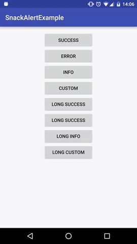

SnackAlert
==========

A small library to show context colored snackbar's.



Download
========

It's currently published via [jitpack](https://jitpack.io)

Add it in your root build.gradle at the end of repositories:
```gradle
allprojects {
	repositories {
		...
		maven { url "https://jitpack.io" }
	}
}
```

and then the dependecy:
```gradle
dependencies {
	compile 'com.github.User:Repo:Tag'
}
```

Usage
=====

```java
SnackAlert.success(view, "success");

SnackAlert.error(view, "error");

SnackAlert.info(view, "info");

SnackAlert.longSuccess(view, "long success");

SnackAlert.longError(view, "long error");

SnackAlert.longInfo(view, "long info");
```
